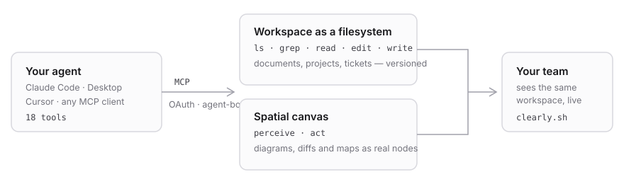

# Clearly for Claude Code and Codex

[](https://github.com/clearly-sh/clearly-plugin/actions/workflows/validate.yml)
[](./LICENSE)
[](https://clearly.sh/docs/mcp)

Your workspace — documents, canvases, sheets, decks, projects, boards and tickets — available to
your coding agent through seven typed MCP tools, with deeper workspace and canvas operations via
the `beehaven` CLI. Changes are attributed to a named agent identity, and recoverable deletes
archive by default.



## Install in Claude Code

```
/plugin marketplace add clearly-sh/clearly-plugin
/plugin install clearly@clearly
/clearly:clearly-init
```

Authentication is **OAuth** — run `/mcp`, pick `clearly`, choose **Authenticate**. The browser
does the rest; there is no token to mint or paste. You'll be asked **which workspace** and **which
agent**, because every credential belongs to a named agent — that is what makes the activity log
say *who* did something rather than only *what happened*.

Grant `rpc:write` unless you want the workspace read-only.

## Install in Codex

```bash
codex plugin marketplace add clearly-sh/clearly-plugin
codex plugin add clearly@clearly
codex mcp login clearly
```

Restart Codex after installing or upgrading so it reloads the plugin's MCP definition and all 14
skills. For a non-browser agent identity, use `beehaven agent login <name>` followed by
`beehaven mcp install --client codex`; the installer binds the credential to that active identity
and does not print the raw token.

## Any other MCP client

The server is hosted. An OAuth-capable client needs only the endpoint:

```json
{ "mcpServers": { "clearly": { "url": "https://relay.clearly.sh/mcp" } } }
```

Working in more than one workspace? A client stores one credential per server entry, so add a
second at `https://relay.clearly.sh/mcp/w/<workspaceId>`.

> **There is no anonymous access.** `tools/list` and `tools/call` both require a credential and
> answer `401` without one — carrying a `WWW-Authenticate` challenge, so a capable client starts
> the sign-in flow by itself. See [SECURITY.md](./SECURITY.md).

## The tool surface — 7

| | |
|---|---|
| **Discover** | `catalog` — optional, lazy schemas scoped to one artifact type and operation, plus title search |
| **Find** | `grep` `glob` — search content or find artifacts by name |
| **CRUD** | `read` `write` `edit` `delete` — the same four verbs cover documents, canvases, sheets, decks, projects, boards and tickets; each supports a bounded same-operation batch |

Names are prefixed `clearly_`. The CRUD tools' top-level schemas are enough to route straightforward
calls; use `clearly_catalog { type, operation }` before a type-specific create or edit to fetch the
precise nested schema. Catalog is scoped by artifact type and operation, not required for every
read. Full reference: [`plugin/README.md`](./plugin/README.md) · [setup](./plugin/SETUP.md) ·
[docs](https://clearly.sh/docs/mcp).

## The 14 skills

Each is a slash command the moment the plugin installs.

**Working in the workspace** — `clearly-init` (connect and verify) · `clearly-workspace` ·
`clearly-docs` · `clearly-workflows` (search → write back, so context compounds) · `clearly-agent`

**On the canvas** — `clearly-canvas` (the operating manual) · `pair-on-canvas` (the board as
mission control for a coding task) · `ship-review` (land a change as a spatial change-map the
human inks back) · `visualize` · `codebase-map`

**Design craft** — `design-craft` (grid construction, modular type scale, colour systems, optical
correction, a verify-before-done pass) · `brand-identity` (brief → mark → lockups → palette →
spec board) · `layout-systems` (poster, deck, landing page, editorial, social — with the real
numbers per format) · `sticker-pack`

## Repositories

| | |
|---|---|
| **clearly-sh/clearly-plugin** | this one — the plugin, its skills, and the marketplace manifest |
| [clearly-sh/clearly](https://github.com/clearly-sh/clearly) | issues, release notes and security reports for the MCP server and the `beehaven` CLI |

## License

MIT © [Clearly](https://clearly.sh)
